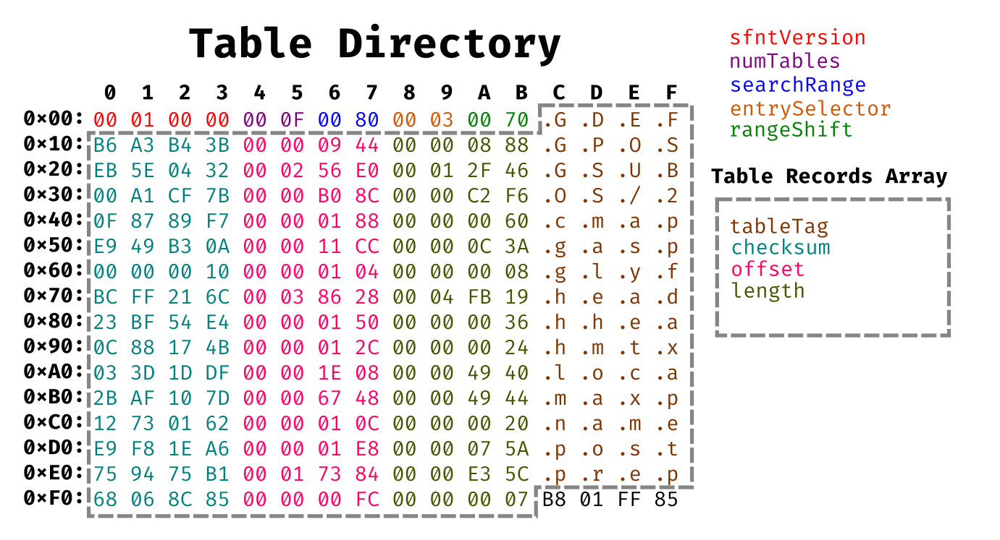

# Overview

~~TTF is the more popular text format (at least on my system).~~  Looks like OpenType (using TrueType outline format) and TrueType formats both use `.ttf` file extension. Also, apparently OpenType is a superset of TrueType format. Apple has documentation for TrueType at: https://developer.apple.com/fonts/TrueType-Reference-Manual/
and Microsoft has documentation for OpenType at: https://docs.microsoft.com/en-us/typography/opentype/spec/ and ISO has Open Font Format Specification (The ISO standard of OpenType) here: (ISO/IEC 14496-22:2019) here: https://standards.iso.org/ittf/PubliclyAvailableStandards/index.html
I want this to be a more basic fundamentals guide on what to do than the TTF reference manual is.

# What needs to happen

* Input character code and size
* Read the TTF file
    - read *table directory* for information about font format the list of tables and their offsets
    - read `cmap` table to get *glyph index* from the character code/encoding
    - read `loca` table to get location of the character data from the *glyph index*
    - read `glyf` table to get the information on drawing the character
* Lookup character data in TTF
* Render character
    - Take curve and line data
    - Generate raster image

# Reading `NotoSans-Bold.ttf`

The start of the file is the [Table Directory](https://docs.microsoft.com/en-us/typography/opentype/spec/otff#table-directory):

version - is `0x00010000` here because it's using TrueType outline format as (thus the `.ttf` extension) as opposed to CCF *(which normally would be `.otf`)*.

numTables - is how many elements are in the `Table Records Array`. Which is 16 (`0xF`) in this case.

tableTag's - are table ID's consisting of 4 character strings.

offset's - are the location in the file look for the table. These offsets are relative to the start of the file (`0x0`).

So `cmap` table of this file starts at `0x11CC`:

version - always 0

numTables - indicates this file only has 1 `EncodingRecord`

platformID and encodingID - indicates *Windows* platform with *Unicode BMP* encoding

subtableOffset - All subtable offsets are relative to beginning of header which they appear. So `0x11CC` + `0xC` = `0x11D8`

format - indicates the subtable format is [Format 4](https://docs.microsoft.com/en-us/typography/opentype/spec/cmap#format-4-segment-mapping-to-delta-values)

length - the length is `0xC2E`. So this subrecord ends at `0x1E05`. *(`0x11D8`+`0xC2E` -1 (because zero indexed) = `0x1E05`)*

segCountX2 - the address of the last byte in all arrays with "segCount" is `<arrayOffset>` + `segCountX2` (because these arrays are 2 bytes long) -1 (because zero indexed) 

endCode[segCount] ends at `0x134B` *(`0x11E6` + `0x166` - 1 = `0x134B`)* and startCode[segCount] ends at `0x14B3` *(`0x134E` + `0x166` - 1 = `0x14B3`)*. Last value should for both arrays always be `0xFFFF`.
