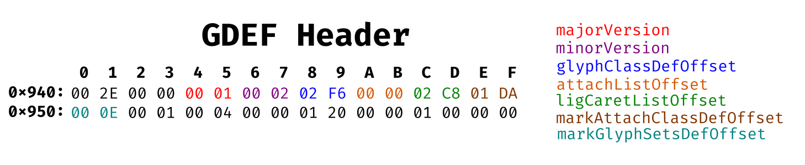
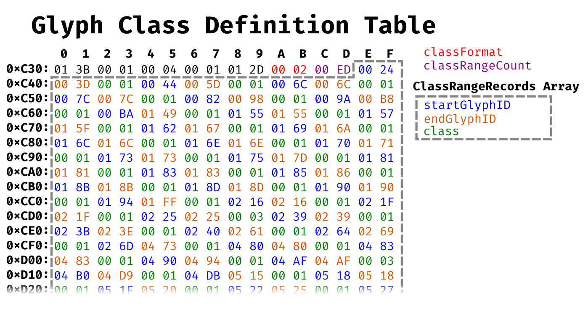

# Overview

~~TTF is the more popular text format (at least on my system).~~  Looks like OpenType (using TrueType outline format) and TrueType formats both use `.ttf` file extension. Also, apparently OpenType is a superset of TrueType format. Apple has documentation for TrueType at: https://developer.apple.com/fonts/TrueType-Reference-Manual/
and Microsoft has documentation for OpenType at: https://docs.microsoft.com/en-us/typography/opentype/spec/ and ISO has Open Font Format Specification (The ISO standard of OpenType) here: (ISO/IEC 14496-22:2019) here: https://standards.iso.org/ittf/PubliclyAvailableStandards/index.html
I want this to be a more basic fundamentals guide on what to do than the TTF reference manual is.

# What needs to happen

* Input character code
* Read the TTF file
* Lookup character data in TTF
* Render character
    - Take curve and line data
    - Generate raster image

# Reading `NotoSans-Bold.ttf`

The start of the file is the [Table Directory](https://docs.microsoft.com/en-us/typography/opentype/spec/otff#table-directory):

sfntVersion - is `0x00010000` here because it's using TrueType outline format as (thus the `.ttf` extension) as opposed to CCF *(which normally would be `.otf`)*.

numTables - is how many elements are in the `Table Records Array`. Which is 16 (`0xF`) in this case.

tableTag's - are table ID's consisting of 4 character strings.

offset's - are the location in the file look for the table. These offsets are relative to the start of the file (`0x0`).

For example the `GDEF` table starts at `0x944`:

The majorVersion and minorVersion says this is a *GDEF Header, Version 1.2*. 

All of the Offsets to the subtables here are relative to the beginning of the GDEF Header (`0x944`). For example glyphClassDefOffset is `0x2F6`. So the Glyph Class Definition table (`GlyphClassDef`) is located at: `0x944` + `0x2F6` = `0xC3A`

The classFormat says this is a *Class Definition Format 2 Table*.

The class is enum value that can be either 1 (Base glyph), 2 (Ligature glyph), 3 (Mark glyph) or 4 (Component glyph).